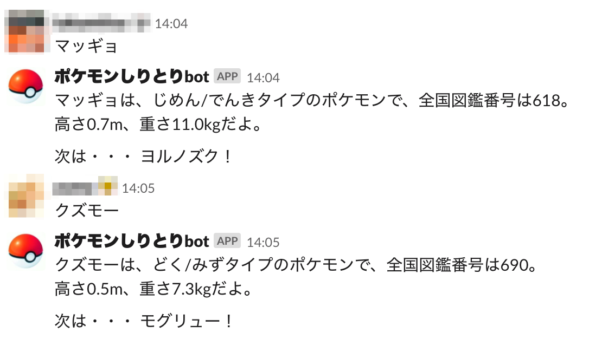

# slack ポケモンしりとり bot

## こんな感じ



## 使い方

### slack-pokemon を clone 

```bash
$ git clone https://github.com/yuma-m/slack-pokemon.git
$ cd slack-pokemon
```

### 設定を編集

`docker-compose.yml` の `environment` 内を編集する
- `SLACK_TOKEN`: Slack の App から Bots を作成し、その TOKEN を記入
- `SLACK_CHANNEL`: 投稿先の Channel の ID を記入
- `SLACK_USERNAME`: Bot のユーザ名を記入
- `SLACK_ICON`: Slack のアイコンにする emoji (`:cat:` など) を記入

### docker-compose で起動

```
$ sudo docker-compose up -d
```

### Slack のチャンネルに Bot を Invite

`\invite @your-bot-name`

## ポケモン情報について

- No.001〜807 まで、メガシンカやアローラのすがたは含みません
- データは http://blog.game-de.com/pokedata/pokemon-data/ から取得させていただきました
